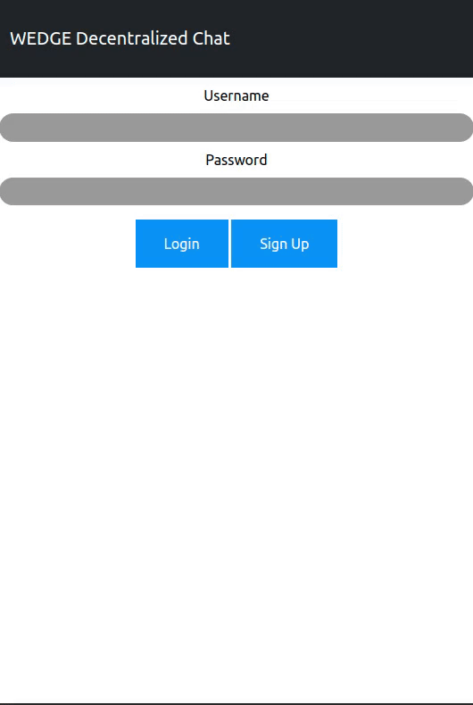

<h1 align="center">WEDGE Decentralized Chat Application</h1>

<p align="center">
  
</p>

## Introduction
Welcome to WEDGE, a decentralized chat application inspired by Fireship's work [here](https://github.com/fireship-io/gun-chat). We've crafted most of the Svelte components from the ground up, enhancing the messaging features pioneered by Fireship. Our tech stack includes Gun.JS, Svelte, Bootstrap, and NodeJS.

Messages are decentralized and stored in users' browsers' website data. To clear messages, simply clear your website data.

## Technologies
* Svelte
* Bootstrap
* NodeJS
* HTML/CSS

## How to Run
Begin by installing npm
```
sudo apt install npm
```
Then execute the following commands
```
npm install

npm run dev
```
Finally input 127.0.0.1:8080 in your browser to view the application!
